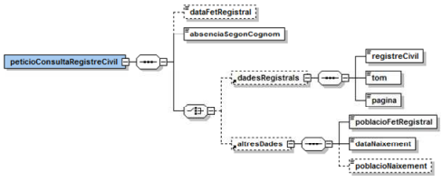
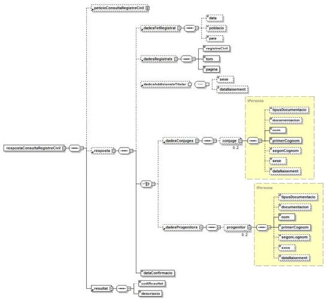

# Via Oberta – Registre Civil

Documentació d'integració del servei Registre Civil del Consorci AOC.

# **Índex** #

1. [Introducció](#1)
2. [Transmissions de dades disponibles](#2)
3. [Missatgeria del servei](#3)
   1. [Consultes al Registre Civil](#3.1)
      1. [Petició – dades genèriques](#3.1.1)
      2. [Petició – dades específiques](#3.1.2)
      3. [Resposta – dades específiques](#3.1.3)
      4.  [Dades de cònjuges i progenitor](#3.1.4)
4.  [Joc de proves](#4)


## 1 Introducció <a name="1"></a>

Aquest document detalla la missatgeria associada al servei de consulta del Registre Civil del
Ministerio de Justicia.

Per a poder realitzar la integració cal conèixer prèviament la següent documentació:

- Document de Missatgeria Genèrica de la PCI del Consorci AOC.

## 2 Transmissions de dades disponibles <a name="2"></a>

Les dades disponibles a través del servei són les que es presenten a continuació:

- **EMISSOR**: Ministerio de Interior 

| **PRODUCTE** | **MODALITAT** | **DESCRIPCIO** |
| --- | --- | --- |
| **REGISTRE_CIVIL** | NAIXEMENT  | Consulta de naixement.
| **REGISTRE_CIVIL** | MATRIMONI  | Consulta de matrimoni.
| **REGISTRE_CIVIL** | DEFUNCIO  | Consulta de defunció.

Totes les consultes del producte tenen disponible la versió imprimible del resultat de la consulta en
format PDF. Per més detalls adreceu-vos a l’apartat Extensions de missatgeria del document de
missatgeria genèrica.

```
Únicament es podrà obtenir informació sobre inscripcions realitzades a partir de l’any 1950.
```
```
Des de l’any 2009 estan informatitzat tot els RRCC principals (431) i el RC Central.
Posteriorment, es va abordar la informatització dels Registres Civils delegats (Jutjats de
Pau). En aquest projecte d’informatització, a Gener de 2013, estan informatitzats 3.
Jutjats de Pau, de un total de 7.677.

El termini previst d inclusió de tots els jutjats de pau és finals de 2013 (data orientativa).
```
## 3 Missatgeria dels serveis <a name="3"></a>

A continuació es detalla la missatgeria corresponent al bloc de dades específiques de les modalitats
de consum del producte.

```
L’emissor de les dades requereix que s’informin les dades del funcionari que realitza la
consulta. Així, cal informar l’element Funcionario del bloc de dades genèriques:
```

```
/Peticion/Funcionario i //SolicitudTransmision/DatosGenericos/Solicitante/Funcionario.
```
### 3.1 Consultes al Registre Civil <a name="3.1"></a>

Per realitzar la consulta de qualsevol de les tres modalitats és necessari indicar en la consulta les
següents dades del titular:

- Nom, primer cognom i segon cognom (aquest darrer en cas que el titular tingui segon cognom).
- Dades addicionals del titular: data del fet registral, absència del segon cognom i un dels següents
    grups de dades:
- Grup I: consulta per documentació.
- Grup II: consulta per dades registrals (registre, tom, pàgina).
- Grup III: consulta per altres dades (població del fet registral, data de naixement).

```
Per garantir l’obtenció de resposta es recomana l’ús del Grup II o el Grup III però no el Grup
I. Fins l’any 2009 no ha estat obligatori indicar la documentació en les inscripcions i, a més a
més, totes les inscripcions digitalitzades els hi manca.
```
```
En cas de naixement la probabilitat d’obtenir resposta amb dades emprant la documentació
és molt baixa ja que en el moment en el que s’inscriu un naixement el ciutadà no en
disposa.
```
```
Si en la consulta s’indiquen les dades del Grup I i d’algun dels altres dos grups, únicament
es tindrà en compte el Grup I.
```
#### 3.1.1 Petició – dades genèriques <a name="3.1.1"></a>

| _Element_ | _Descripció_ |
| --- | --- |
//DatosGenericos/Titular/TipoDocumentacion | Tipus de documentació (NIF, Pasaporte, NIE).
//DatosGenericos/Titular/Documentacion | Documentació. Informar només en cas de consulta per Grup I. En cas de consulta per Grup II o III informar-lo buit “”.
//DatosGenericos/Titular/Nombre | Nom del titular.
//DatosGenericos/Titular/Apellido | Primer cognom del titular.
//DatosGenericos/Titular/Apellido | Segon cognom del titular (només si el titular enté).

#### 3.1.2 Petició – dades específiques <a name="3.1.2"></a>

| _Element_ | _Descripció_ |
| --- | --- |
/peticioConsultaRegistreCivil/dataFetRegistral | Data del fet registral (AAAA-MM-DD ). Obligatòria només en consultes de naixement i matrimoni. S’obvia en consultes de defuncions.
/peticioConsultaRegistreCivil/absenciaSegonCognom | <ul><li>true : el titular NO té segon cognom.</li><li>false : el titular té segon cognom.</li></ul>

Grup II (dades registrals)
| _Element_ | _Descripció_ |
| --- | --- |
/peticioConsultaRegistreCivil/dadesRegistrals/registreCivil | Codi de registre civil (composat per dígits). Vegeu RRCC_INFORMATIZADOS.xlsx i RRCC_CONSULADOS.xlsx.
/peticioConsultaRegistreCivil/dadesRegistrals/tom | Identificador de Tomo o Llibre del Registre.
/peticioConsultaRegistreCivil/dadesRegistrals/pagina | Foli o pàgina del Registre.

Grup III (altres dades)
| _Element_ | _Descripció_ |
| --- | --- |
/peticioConsultaRegistreCivil/altresDades/poblacioFetRegistral | <ul><li>Codi INE (5 dígits).</li><li>En cas de consolats: 00 + codi de consolat (vegeu RRCC_CONSULADOS.xlsx).</li></ul>
/peticioConsultaRegistreCivil/altresDades/dataNaixement | Data de naixement (AAAA-MM-DD).
/peticioConsultaRegistreCivil/altresDades/poblacioNaixement | <ul><li>Codi INE (5 dígits).</li><li>En cas de consolats: 00 + codi de consolat (vegeu RRCC_CONSULADOS.xlsx).</li></ul>

<p align="center">

</p>

https://idapadron.ine.es/ape403expl/inicio.menu


#### 3.1.3 Resposta – dades específiques <a name="3.1.3"></a>

<p align="center">

</p>

| _Element_ | _Descripció_ |
| --- | --- |
/respostaConsultaRegistreCivil/peticioConsultaRegistreCivil | Bloc de dades corresponent a la petició que genera la resposta.
/respostaConsultaRegistreCivil/resposta | Bloc de dades corresponent a la resposta.
//resposta/dadesFetRegistral/data | Data del fet registral (AAAA-MM-DD).
//resposta/dadesFetRegistral/poblacio | Població en la que es va produir el fet registral.<ul><li>Codi INE (5 dígits).</li><li>En cas de consolats: 00 + codi de consolat (vegeu RRCC_CONSULADOS.xlsx ).</li></ul>
//resposta/dadesFetRegistral/pais | Codi país (INE).
//resposta/dadesRegistrals/registreCivil | Codi de registre civil (composat per dígits). Vegeu RRCC_INFORMATIZADOS.xlsx i RRCC_CONSULADOS.xlsx.
//resposta/dadesRegistrals/tom | Identificador de Tomo o Llibre del Registre.
//resposta/dadesRegistrals/pagina | Foli o pàgina del Registre.
//resposta/dadesAddicionalsTitular/sexe | Sexe: H (home) / D (dona).
//resposta/dadesAddicionalsTitular/dataNaixement | Data de naixement (AAAA-MM-DD).
//resposta/dadesConjuges | Bloc de dades corresponent a les dades dels cònjuges (només consulta de matrimoni).
//resposta/dadesConjuges/conjuge | Bloc de dades corresponent a les dades d’un cònjuge (només consulta de matrimoni). Vegeu següent apartat.
//resposta/dadesProgenitors | Bloc de dades corresponent a les dades dels progenitor (només consulta de naixement).
//resposta/dadesConjuges/progenitor | Bloc de dades corresponent a les dades d’un progenitor (només consulta de naixement). Vegeu següent apartat.
//resposta/dataConfirmacio | Data de generació de la resposta (AAAA-MM-DD).
/respostaConsultaRegistreCivil/resultat/codiResultat | <ul><li>0003 : titular localitzat.</li><li>0005 : titular NO localitzat.</li><li>0006 : més d’un titular amb les dades proporcionades.</li><li>0502 : error realitzant la resposta.</li></ul>
/respostaConsultaRegistreCivil/resultat/descripcio | Descripció del resultat.

#### 3.1.4 Dades de cònjuges i progenitor <a name="3.1.4"></a>

| _Element_ | _Descripció_ |
| --- | --- |
//tipusDocumentacio Tipus de documentació (NIF, Passaport, NIE)
//documentacio | Documentació.
//nom | Nom.
//primerCognom | Primer cognom.
//segonCognom | Segon cognom.
//sexe | Sexe: H (home) / D (dona).
//dataNaixement | Data de naixement (AAAA-MM-DD .

## 4 Joc de proves <a name="4"></a>

L’emissor final de les dades proporciona les següents dades vàlides per l’entorn de preproducció:

- Naixements:

| _Tipus Documentació_ | _Documentació_ | _Nom_ | _Primer cognom_ | _Segon cognom_ | _Data fet registral_ | _Absència segon cognom_ | _Registre civil_ | _Tom_ | _Pàgina_ | _Població fet registral_ | _Data naixement_ | Població naixement |
| --- | --- | --- | --- | --- | --- | --- | --- | --- | --- | --- | --- | --- |
|| CANDELA | PÉREZ | PÉREZ | 03/08/2011 | false | 090596200111 | 00001 | 113
|| PABLO | JESUS | MINGUEZ | GARCIA | 08/02/2012 | false | Carcabuey | 08/02/2012 | Carcabuey
NIE | X5000007Z | NATIVIDAD | PEREZ | 01/02/2000 | true | 140154600111 | 00001 | 227 | 99999 | 01/02/2000
NIE | X0000711K | AZALEA | PEREZ | PEREZ | 01/01/1990 | false | 280796000111 | 51056 |073 | 99999 | 01/01/1990

- Matrimonis:

| _Tipus Documentació_ | _Documentació_ | _Nom_ | _Primer cognom_ | _Segon cognom_ | _Data fet registral_ | _Absència segon cognom_ | _Registre civil_ | _Tom_ | _Pàgina_ | _Població fet registral_ | _Data naixement_ | Població naixement |
| --- | --- | --- | --- | --- | --- | --- | --- | --- | --- | --- | --- | --- |
NIF | 07568567A | JESU | CHIU | CHIU | 2011-10-24 | false | | | | | | 

- Defuncions:

| _Tipus Documentació_ | _Documentació_ | _Nom_ | _Primer cognom_ | _Segon cognom_ | _Data fet registral_ | _Absència segon cognom_ | _Registre civil_ | _Tom_ | _Pàgina_ | _Població fet registral_ | _Data naixement_ | Població naixement |
| --- | --- | --- | --- | --- | --- | --- | --- | --- | --- | --- | --- | --- |

Pasaport | 232323 | BUENO | CARACOLO | 2011-10-24 |false
Pasaport | 12164948 | JUSTINIANO | GONZALEZ | CRESPO | 02/02/2010 | false | 140154600111 | 00001 | 125
NIF | 77508907B | MARTA | DELATA | TIMO | 24/10/2011 | false Carcabuey | 10/10/1980 | Carcabuey
JUSTINIANO | GONZALEZ | CRESPO | 02/02/2010 | false | 140154600111 | 00001 | 125
NIF | 51452555Z | JUAN | CARLOS | SEVILLA | FERNANDEZ | 1990-03-25 | false | 090596200111 | 00001 | 109
NIF | 50737073Q | CRISTOBAL | HERMIDA | PORTALES | 1985-01-01 | false | 090596200111 | 00001 | 111
NIF | 53424681M | CHRISTIAN | GARRIDO | VALLEJOS | 2000-05-15 | false | 090596200111 | 00001 | 113
NIE | X0718150K | CONOR | DONNELLAN | 2008-12-30 | true | 090596200111 |00001 | 115
Pasaport | 95786787 | GENOVEVA | PEREZ | PEREZ | 2013-07-01 | false | 090596200111 | 00001 | 121 | Burgos | 1940-01-01
NIF | 50000001W | CAMELIA | PEREZ | PEREZ | 2013-07-05 | false | 090596200111 | 00001 | 123 | Burgos | 1950-01-25 | Burgos
